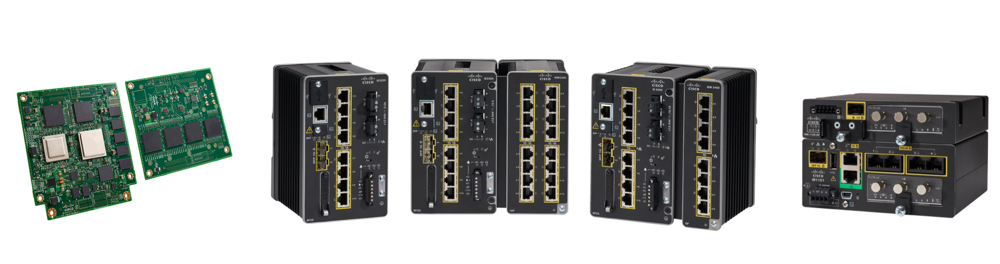
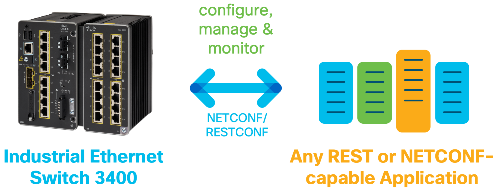
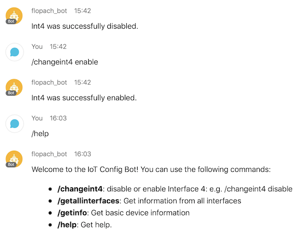
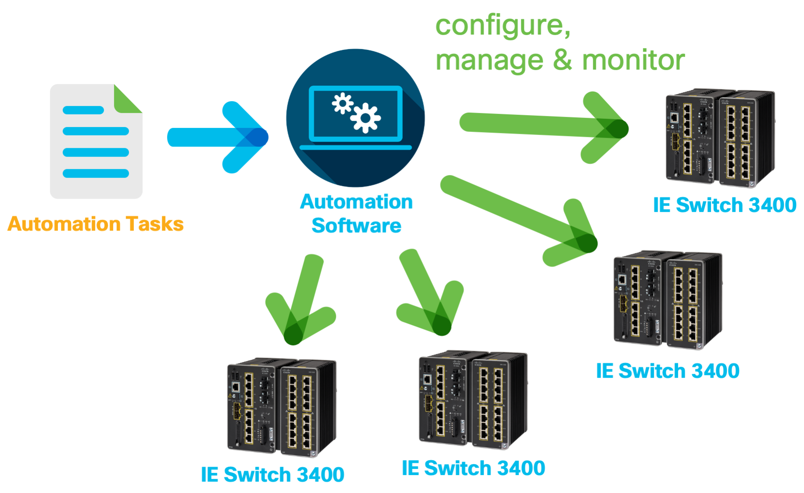
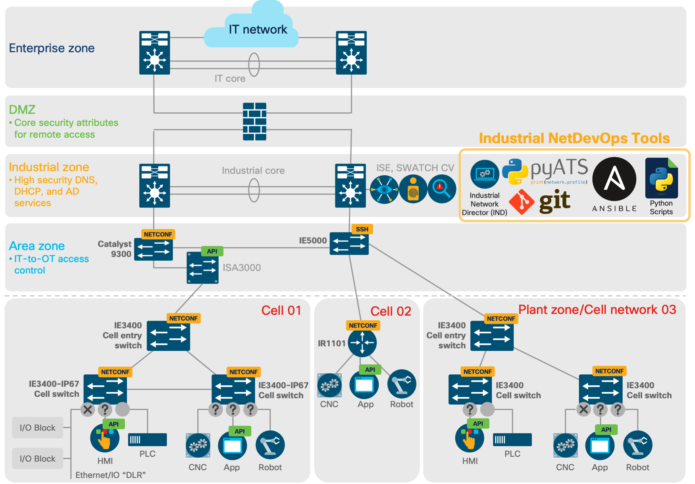

# Industrial NetDevOps: Getting Started with Programmability & APIs on Cisco IoT Hardware

> **Industrial NetDevOps is the combination of the tools and best practices from DevOps with network engineering and operations in industrial networks.**

Instead of using SNMP and CLI, you configure, manage and monitor industrial network devices via **standardized network device APIs and software automation tools**. Industrial NetDevOps workflows use Open Source, standards and Python scripts alongside commercial devices and tools to deliver flexible and fast-responsive industrial networks.

This is a collection of scripts which will get you started on how NETCONF & RESTCONF works especially on Cisco IoT hardware. Also, some Ansible playbooks are here to get you started with Ansible.

* IOS XE on Cisco IR1101
* IOS XE on Cisco IE3200, IE3300, IE3400
* IOX XE on Cisco ESS3300



## Script Overview

> For more information on how to use these scripts, definitely check out the learning labs at [DevNet Learning Labs](https://developer.cisco.com/learning/tracks).



### /NETCONF

**netconf-getting-started.py**: Specifically created for the DevNet Learning Lab

* YANG models what the device is supporting
* Running Config in XML
* Get one single value using whole config and a XML filter
* Get the status of all interfaces

**netconf-IR1101.py**

Get the lastest YANG model here: https://github.com/YangModels/yang/tree/master/vendor/cisco/xe (Version 17.x)

* Basic functions
* Enable/disable Interface 4
* Set a SCADA Config. This is possible since 17.1. You can find more information in the [software configuration guide](https://www.cisco.com/c/en/us/td/docs/routers/access/1101/software/configuration/guide/b_IR1101config/b_IR1101config_chapter_01111.html#con_1138532)

**netconf-webexbot.py**

You can also connect the configuration part with a Webex Teams bot to make it more interactive (**ChatOps**).

1. Create easily a Webex bot online at [developer.webex.com](https://developer.webex.com)
2. Add the credentials of your bot in the script. You can find information on how to setup your bot with ngrok.io here: https://developer.cisco.com/learning/modules/spark-apps/collab-spark-botl-ngrok/step/1
3. Ready to use



### /RESTCONF

**restconf-getting-started.py**: Specifically created for the DevNet Learning Lab

* YANG models what the device is supporting
* Running Config in JSON
* Get one single value of the configuration
* Get the status of all interfaces

### /Ansible

* Ansible sample Playbooks and Hosts file to get you started

Follow the [Introduction to Ansible for IOS XE Configuration Management Learning Labs](https://developer.cisco.com/learning/modules/intro-ansible-iosxe) on how to apply the playbooks.

## Use-cases

### Network Automation



### Industrial NetDevOps in Manufacturing

Here is an example architecture where your Industrial NetDevOps tools can be placed and used.



## Getting your Hands dirty

For more information on how to use these scripts, definitely check out the learning labs at [DevNet Learning Labs](https://developer.cisco.com/learning/tracks).

### A) Setup your virtual environment (optional)

1. Clone this repo in your project folder via git

```
git clone https://github.com/flopach/industrial-netdevops
```

2. Create your python virtual environment

Python 2

```
pip install virtualenv
python -m virtualenv venv_dir
```

Python 3

```
pip3 install virtualenv
python3 -m venv venv_dir
```

3. Activate your virtual environment

```
source venv_dir/bin/activate
```

4. Install the required python libraries (depending on your python version):

```
pip install -r requirements.txt
pip3 install -r requirements.txt
```

5. Now you can run your script.

### B) Configuration needed on the device

Do not forget to enable NETCONF and/or RESTCONF on the device when using the APIs.

```
device(config)#netconf-yang
device(config)#restconf
```

## Built With

* [ncclient](https://github.com/ncclient/ncclient) - a very useful python library for NETCONF
* [Webexteamsbot](https://github.com/hpreston/webexteamsbot) - Easy python library to create Webex Bots
* [Webexteamssdk](https://github.com/CiscoDevNet/webexteamssdk) - Webex Teams python library 
* [XMLtoDict](https://github.com/martinblech/xmltodict) - Python library to switch between XML and dicts

## Versioning

**11/2020**: Updated NETCONF scripts and License

**06/2020**: Added RESTCONF, Ansible and Industrial NetDevOps Story

**12/2019**: Added 3 inital scripts

## License

This project is licensed under the Apache License 2.0 - see the [LICENSE.md](LICENSE.md) file for details

## Further Links

* [Cisco DevNet Website](https://developer.cisco.com)
